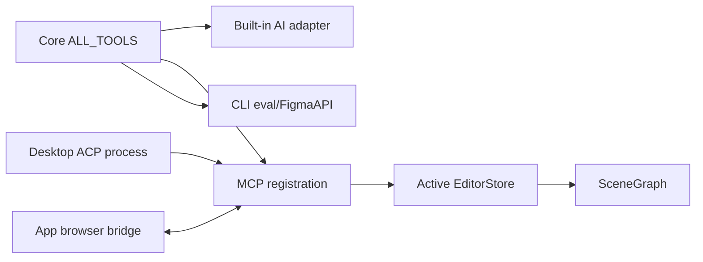

# AI, ACP, Automation, and MCP

Core tools are framework-agnostic `ToolDef` objects in `packages/core/src/tools/`; `registry.ts` assembles `ALL_TOOLS`. `defineTool()` supplies typed parameters and an `execute(figma, args)` function. The AI adapter turns them into provider schemas; MCP turns them into Zod-backed MCP tools; CLI `eval` reaches the Figma API but CLI commands are not generated from the registry.

Built-in AI in `src/app/ai/tools/index.ts` is store-scoped through a `WeakMap`, enforces a 50-step budget, snapshots mutating pages, recomputes layout, renders, and creates one undo entry with forward/inverse snapshots. ACP in `src/app/ai/acp/` maps agent session updates to UI messages and spawns desktop agents through the Tauri shell plugin; permission requests are user-approved and time out.

The browser automation bridge in `src/app/automation/bridge/server.ts` uses the active-store resolver and a local WebSocket. MCP HTTP/stdio is implemented in `packages/mcp`: HTTP serves `/health`, `/rpc`, and `/mcp`; stdio connects to an already-running app WebSocket. MCP file operations are root-scoped, `eval` is disabled unless `OPENPENCIL_MCP_EVAL=1`, and configured bearer tokens are exact-match checks.

Separate these contracts when editing: tool schema/execute semantics belong in core; provider adaptation belongs in AI/MCP; process and permission behavior belongs in ACP; active-store and WebSocket cleanup belongs in automation. Focused tests include `tests/engine/tools/registry.test.ts`, `tests/engine/tools/ai-adapter.test.ts`, `tests/engine/mcp/path-scoping.test.ts`, `tests/engine/mcp/server.test.ts`, and `tests/engine/acp/transport.test.ts`.
