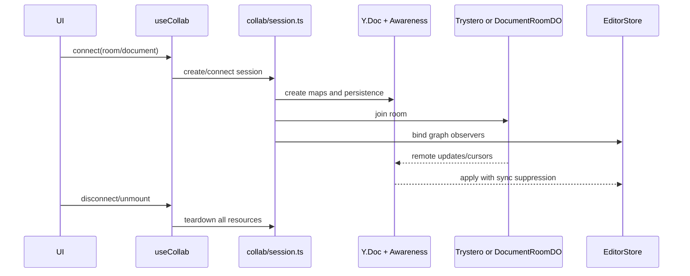

# Collaboration Sessions

`src/app/collab/use.ts` is the Vue composition boundary. It owns collaborator identity, reactive state, cursor/selection broadcasting, follow mode, and connection actions. `src/app/collab/session.ts` creates a Y.Doc, Awareness, node/image maps, IndexedDB persistence, a connected store, and graph observers. Local rooms use Trystero signaling; hosted documents select `{ mode: 'hosted-do', documentId }` and connect through the hosted room service.

Persistence names are `op-room-${roomId}` for local rooms and `op-room-hosted-${documentId}` for hosted rooms. Connecting a new session first disconnects the old one. Disconnect unbinds graph listeners, stops viewport watchers, clears awareness, leaves transport, destroys persistence/Y.Doc, resets state, and clears remote cursors. Applying Yjs updates must suppress graph-to-Yjs feedback loops.

Hosted collaboration requires hosted auth, hosted docs, a route `documentId`, and the collaboration flag. `/hosted` without an ID does not connect a hosted room. `src/app/collab/room.ts` converts the API origin to `ws/wss` and connects to `/api/documents/:documentId/room` with `openpencil-room.v1` and optional `bearer.<token>` protocols. It first calls the snapshot route with cookie/bearer credentials, applies the Yjs snapshot as a remote update, hydrates available assets into the `images` map, and marks missing assets as degraded rather than failing the whole document. An unavailable current snapshot is a 409 bootstrap error; an expired token tells the user to sign in again. On open it sends sync-step1 and awareness; `room-state`, `yjs-update`, and `sync-reply` are applied with remote-origin suppression. A close schedules reconnect after 700ms while retaining the Y.Doc and IndexedDB key; disconnect destroys persistence and clears awareness/cursors.

The API authenticates and owner-checks the room route, derives room identity from `documentId`, and forwards user/document/room identity to `DocumentRoomDO`. The DO tracks peers, broadcasts recognized Yjs updates and awareness, and rejects malformed wire shapes. Room state is stored under `room-state`: load applies the compacted snapshot then pending updates; each update is appended and asynchronous persistence is requested. Compaction occurs at 24 updates or 131072 pending bytes, replacing the queue with `Y.encodeStateAsUpdate`, resetting counters, and recording reason/timestamp. Persistence writes are fire-and-forget: a failure can leave applied/broadcast updates undurable, and a failed compaction write can leave memory compacted while durable storage remains pre-compaction. Focused evidence is in `api/src/documents/room-persistence.test.ts`, `tests/e2e/hosted-collab.spec.ts`, `tests/engine/collab/yjs-sync.test.ts`, and API room tests.
