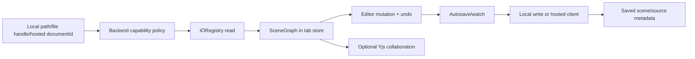

# Document Lifecycle and Storage Backends

`src/app/document/io/create.ts` constructs the per-store document surface. `src/app/document/io/backend.ts` defines operating modes and capability checks; `local-backend.ts` handles browser/Tauri sources, while `hosted-backend.ts` requires a canonical `documentId` and a supplied hosted client. Hosted enablement alone does not make hosted I/O usable: missing runtime wiring intentionally raises `hosted-runtime-unavailable`.

Open reads bytes through the selected backend, calls the core `IORegistry`, applies the imported graph, restores document metadata, fits the viewport, and requests a render. Reload captures page/selection/editor state, replaces the graph, clears undo history, restores state, and marks the current scene saved. Write selects a Tauri path or browser `FileSystemFileHandle`; if neither exists, the writer is a no-op and callers must use explicit download/export behavior.

Autosave and file watching live under `src/app/document/autosave/` and `src/app/document/io/watch.ts`. Source metadata, saved scene versions, planned paths, and extensionless names are part of the contract. Tabs own these states independently; collaboration may replace graph content but must not silently change the source backend.

Hosted API CRUD and asset storage are implemented under `api/src/documents/`, with schema/migration evidence in `api/migrations/0001_hosted_documents.sql`. Local-to-hosted promotion, duplicate, migration, and asset hydration must retain document identity and degrade explicitly when remote assets or clients are unavailable.

Focused evidence: `tests/engine/document/backend-contract.test.ts`, `tests/engine/tauri/document-io.test.ts`, `tests/e2e/autosave.spec.ts`, `tests/e2e/document-backend.spec.ts`, and `tests/unit/hosted-storage.test.ts`. The key sharp edge is that a successful call path without a writable source is not proof that bytes were persisted.
