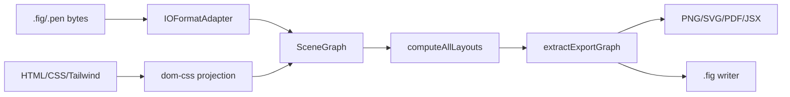

# Documents, SceneGraph, and Format Adapters

The canonical in-memory document is core's `SceneGraph`. `packages/core/src/io/types.ts` defines `IOFormatAdapter`, read/write/export requests, target scopes, and `IOContext`; `packages/core/src/io/registry.ts` filters adapters by declared capability and dispatches operations. `BUILTIN_IO_FORMATS` in `packages/core/src/io/formats.ts` registers native `.fig`, read-only `.pen`, raster, SVG, PDF, and JSX adapters.

A CLI or app caller must compute layouts after reading; layout is not an implicit `IORegistry.readDocument()` postcondition. Export targets are document, page, selection, or node. `extractExportGraph()` clones the necessary roots, descendants, and component dependencies; instance children are intentionally not serialized as ordinary children.

`.fig` parsing converts Kiwi node changes into graph nodes and preserves schema/source metadata. Export reuses the imported schema when available, reserves IDs, scans imported IDs before generating new ones, assigns canvas IDs before variable IDs, and serializes pages, images, variables, blobs, and metadata. These rules protect compatibility and collision safety.

DOM/CSS import is owned by `@open-pencil/dom-css`; browser and headless runtimes differ in CSS fidelity. See [DOM/CSS](../packages/dom-css.md). Focused tests include `tests/engine/io/subgraph.test.ts`, `tests/engine/io/fig/roundtrip/exhaustive.test.ts`, GUID collision tests, source metadata tests, variables/text/images tests, and package Kiwi tests.
