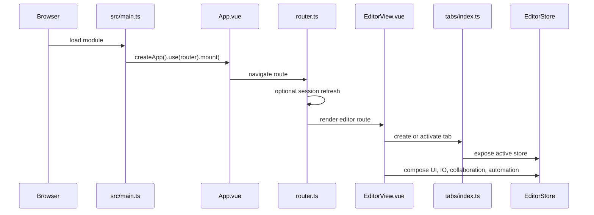

# Editor Runtime and Session Composition

`src/main.ts` is the browser/Vite entrypoint: it preloads fonts, creates the Vue app, installs the router and Unhead, mounts `App.vue` at `#app`, and registers the PWA service worker outside Tauri. `src/App.vue` creates the root editor store/context, applies theme and global error handling, and renders the router view. Tauri uses the same frontend bundle while `desktop/tauri.conf.json` supplies the native shell and file associations.

`src/router.ts` owns route composition. `/`, `/demo`, `/share/:roomId`, and hosted routes render `EditorView`; `/login` and `/auth/callback` form the hosted auth flow. `requireAuth()` only gates routes when `isHostedAuthEnabled()` is true, then calls `refreshSession()` and redirects unauthenticated users to `/login`. The `hostedOnly` metadata is descriptive in the current guard, not an independent capability check.

## Store composition

`src/app/editor/session/create.ts` creates the app-level store. It creates or accepts a `SceneGraph`, reactive `AppEditorState`, core `createEditor()`, an `IORegistry`, and app modules. `src/app/editor/session/modules.ts` adds document open/save/reload/watch, autosave, export/download, vector editing, pen state, profiling, flashes, and mobile clipboard. The core editor modules are documented in [core scene graph and editor](../packages/core/scene-graph-editor.md).

`src/app/tabs/index.ts` maintains tab identity and activation. `activateTab()` updates the active tab, calls `setActiveEditorStore()`, and publishes the store to the app bridge. Automation and UI code must resolve the active store rather than retain a stale tab instance. Closing the final tab creates a replacement before disposal, so teardown can briefly change global active-store state.

## Runtime differences

- Browser: Vite serves the app; `virtual:pwa-register` registers the service worker; browser file handles and downloads back local document I/O.
- Tauri: native filesystem/dialog/shell/updater plugins provide file associations, desktop agent processes, and release updates; the frontend still runs from `http://localhost:1420` in development.
- Hosted mode: auth, API origin, callback URL, documents, and collaboration are independently resolved but constrained by topology rules in `src/app/hosted/flags.ts`.

Focused tests include `tests/e2e/hosted-route-gating.spec.ts`, `tests/engine/app/editor-store-path.test.ts`, and Tauri document tests under `tests/engine/tauri/`.
