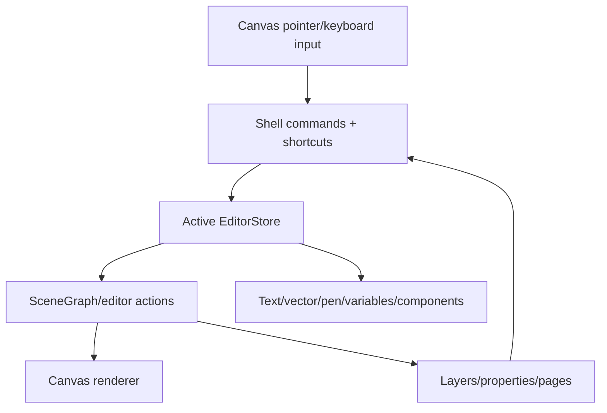

# Editor UI and Interaction Layer

`src/views/EditorView.vue` is the UI composition root. It selects desktop, mobile, collapsed, or bare-canvas layouts, provides collaboration, starts MCP/automation integrations, and owns mount/unmount cleanup. `src/components/EditorCanvas.vue` is the canvas boundary: it connects CanvasKit rendering and pointer/keyboard input to the Vue SDK and active store. Panels such as `src/components/PropertiesPanel.vue`, `LayerTree.vue`, and `PagesPanel.vue` read derived selection state and dispatch editor actions instead of mutating graph internals directly.

Commands and shortcuts are registered in `src/app/shell/keyboard/registry.ts` and shell menu modules. Toolbar actions in `src/components/Toolbar/actions.ts` map user intent to editor commands. Property sections, for example `src/components/properties/LayoutSection/LayoutSection.vue`, use Vue SDK controls and core editor actions; this preserves mixed-value, selection-capability, and undo behavior.

Text editing, vector editing, and the pen tool are separate lifecycle domains attached by the session modules. Text starts and commits edits through core text actions; vector edit state is managed under `src/app/editor/vector-edit/`; pen creation/resume lives under `src/app/editor/pen/`. Variables and components are exposed through dedicated dialogs/panels and core APIs, not through ad hoc node-field edits.

Responsive UI is a product boundary, not a second editor engine: all modes consume the same active store and graph. Cleanup must stop collaboration, MCP, automation, file-association listeners, and editor-specific watchers on unmount. Representative tests include `tests/e2e/editor/auto-layout/basic.spec.ts`, `tests/e2e/text/editing.spec.ts`, panel/property suites, and `tests/engine/vue/editor/menu-model/canvas.test.ts`.

Before changing a UI interaction, identify the command/action owner, the active-store lookup, the undo boundary, and the focused E2E test. Do not bypass the editor session or mutate the graph from a component.
