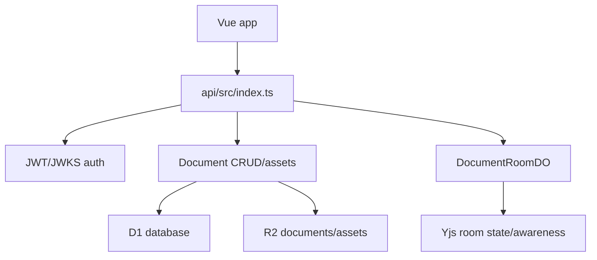

# Hosted API and Runtime Storage

`api/src/worker.ts` exports `OpenPencilApi`, asserts auth configuration in its constructor, delegates requests to the Hono app in `api/src/index.ts`, and exports `DocumentRoomDO`. The API package is private and runs with Wrangler (`bun --cwd api run dev`, `bun --cwd api run deploy`, `bun --cwd api run cf-typegen`, `bun --cwd api test`).

Wrangler bindings in `api/wrangler.jsonc` define separate stage/production D1 databases, R2 document and asset buckets, and the `DOCUMENT_ROOM` Durable Object binding. Named environments repeat bindings because Wrangler environments do not inherit top-level bindings. The checked-in schema creates `hosted_documents` (`active|archived`), `hosted_snapshots` with cascading document FK, optional `parent_snapshot_id`, unique storage key, positive byte length, hash, and reason `initial-import|manual-save|autosave|duplicate`; `hosted_assets` are snapshot/document scoped with kind `image|font|binary`; `hosted_document_migrations` tracks `create-empty|import-local|promote-local|duplicate-hosted` and `pending|complete|failed`. `current_snapshot_id` and its storage key must move together with snapshot lineage and hashes. Apply `api/migrations/0001_hosted_documents.sql` through the environment's Wrangler/D1 procedure; do not infer schema from frontend types alone. `createHostedDocumentMetadata` derives the D1 document row, initial snapshot row, migration row, and asset records from requested IDs, title, format, source kind/fingerprint, content hash, storage key, byte length, and migration kind/state. A source fingerprint is an optional provenance string for a browser file handle, Tauri path, download, IO-registry import, or hosted source; it is not the content hash. `current_snapshot_id` and its storage key are updated together; `parent_snapshot_id` preserves lineage; lifecycle remains `active` or `archived` rather than being inferred from snapshot writes. Existing migration/document state is preserved by creating a new snapshot lineage and updating only the current pointer for save/autosave; migration kind/state records the initial import/promotion/duplicate transition and is not rewritten as a save side effect. Cascade/owner constraints are covered by `api/src/documents/crud.test.ts` and schema/migration tests.

Authentication is enforced by `api/src/auth.ts`. `ELF_JWT` (or the configured cookie), `Authorization: Bearer`, and `Sec-WebSocket-Protocol: bearer.<token>` are accepted; differing simultaneous credentials fail with `identity-conflict` before verification. No credential maps to 401 `missing-session`; an invalid token maps to 401 `invalid-token`. Missing `ELF_JWKS_URL`, `ELF_ISSUER`, or `ELF_AUDIENCE` raises `OPENPENCIL_AUTH_MISSING_PRECONDITION` unless the exact test-only `ALLOW_DEV_STUB_AUTH=1` is enabled. `api/src/auth.test.ts` covers extraction, conflicts, stub auth, and JWT verification.

Hosted document routes in `api/src/index.ts` delegate to `api/src/documents/crud.ts`: create is `POST /api/documents`, snapshot save is `PUT /api/documents/:documentId/snapshot`, snapshot read is `GET /api/documents/:documentId/snapshot`, and assets are document-scoped. Ownership is checked before reads/writes; missing documents are 404 and wrong owners are 403/401 route errors. Create/save writes R2 bytes before D1 metadata/pointer updates, so R2 failure leaves D1 unchanged but D1 failure can orphan an object. Snapshot hydration can return 409 for a missing current object. Delete removes R2 objects before D1 deletion, so failure windows are explicit rather than transactional across services. Focused CRUD coverage is in `api/src/documents/crud.test.ts`.

Frontend `src/app/document/io/hosted-client.ts` sends credentials/cookies and base64 snapshot payloads to these routes, converts HTTP errors to hosted document errors, and exposes open/save/save-as/autosave. Asset hydration is part of snapshot response handling: `hydrateHostedSnapshotAssets()` reads each D1 asset row's storage key from R2 and returns `{ assets, missingAssetIds, degraded }`; ready records contain base64 bytes, while missing records contain `bytesBase64: null`. Missing assets do not fail the snapshot, but a missing current snapshot is a 409. Create/save writes snapshot bytes and metadata; autosave uses the same snapshot write/pointer path with reason `autosave`; asset writes are R2-before-D1 and can orphan R2 bytes if metadata insertion fails; delete removes R2 snapshot/assets before D1 deletion and can leave metadata pointing at removed objects if D1 deletion fails. The frontend must not treat the backend as available merely because hosted flags are on; `hosted-backend.ts` requires a client and canonical `documentId`. CRUD tests cover ownership, create/save/delete and asset error paths; `api/src/documents/assets.test.ts`, `api/src/documents/crud.test.ts`, `tests/unit/hosted-storage.test.ts`, and document-backend tests cover the client-to-storage contract.

Frontend session requests go to `/api/session`; hosted feature flags require a valid API origin and enforce auth -> docs -> collaboration prerequisites.

The room route `GET /api/documents/:documentId/room` authenticates first, resolves ownership (with the explicit `doc_test` development exception), returns 404 for an unavailable document, derives a deterministic namespaced room ID, and forwards the authenticated user/document/room headers to `DocumentRoomDO`. `deriveHostedRoomId` is tested for determinism and namespacing in `api/src/documents/room-id.test.ts`.

The snapshot route follows the document's current snapshot pointer and queries assets for that snapshot only. Hydration returns per-asset `ready`/`missing`, base64 bytes or null, `missingAssetIds`, and `degraded`; missing snapshot bytes are HTTP 409 while missing assets are a successful degraded response. Asset upload validates document ownership, derives `documents/${documentId}/assets/${assetId}`, computes and stores the length/first-byte/last-byte hash, writes R2, then inserts the D1 row using the caller's `snapshotId`. Source does not visibly verify that the snapshot is current or belongs to the document, so a mismatched row may be inserted successfully (subject to database FK behavior if the ID is nonexistent) but remain invisible to current-snapshot hydration; no dedicated route test establishes the response or cleanup behavior for an unrelated/nonexistent `snapshotId`. Content hashes are exactly `sha256:${bytes.length.toString(16)}:${firstByte.toString(16)}${lastByte.toString(16)}` (with the empty case handled by the implementation); distinct same-length bytes sharing first and last bytes collide, so these are stable metadata, not collision-resistant identity or proven deduplication. Snapshot keys are `documents/${documentId}/snapshots/${snapshotId}.fig`; asset keys use the asset path above. Document deletion collects and de-duplicates historical snapshot/asset keys, deletes R2 objects in parallel, then relies on D1 cascade; single-asset deletion performs the same R2-before-D1 sequence for one row. Partial failures are not cross-store transactional: orphaned objects, stale metadata, or deleted objects with surviving metadata are possible, and focused recovery tests are not established.

API tests are `api/src/auth.test.ts`, `api/src/index.test.ts`, `api/src/wrangler-stage-isolation.test.ts`, `api/src/documents/crud.test.ts`, `api/src/documents/assets.test.ts`, and document-focused tests under `api/src/documents/`. Hosted integration proof runs Wrangler locally and then `bun run proof:all`; see [quality and release](../operations/quality-and-release.md).
