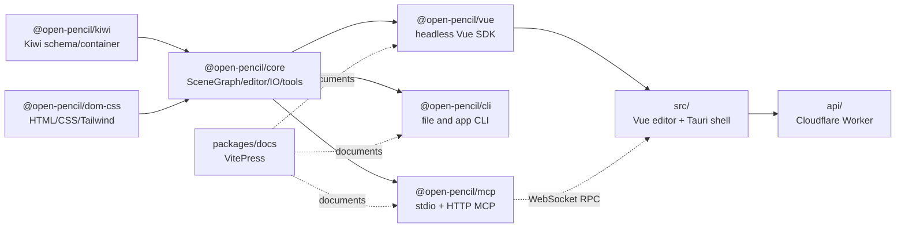

# OpenPencil Architecture Overview

OpenPencil is an open-source design editor for `.fig` and `.pen` documents. The root application in `src/` is the interactive Vue/Vite editor and Tauri desktop shell; the `packages/` workspaces are reusable libraries and agent-facing tools; `api/` is a separate Cloudflare Worker for hosted auth-adjacent document and collaboration services; `packages/docs/` is the VitePress documentation site. It is a fork of upstream OpenPencil with narrow CH5 hosting/federation additions; `AGENTS.md` is the authoritative provenance note.

The repository boundary is deliberately layered: low-level Kiwi bytes do not know about scene graphs; `@open-pencil/core` owns graph/editor semantics; `@open-pencil/vue` adapts the editor to headless Vue surfaces; the app composes those surfaces with product UI; CLI and MCP are adapters rather than alternate scene-graph implementations. Hosted services are optional: local mode has no API dependency, while hosted flags select API-backed auth, documents, and collaboration.

## Main navigation

- [Editor runtime](editor-runtime.md) follows `src/main.ts` through `App.vue`, routing, tabs, and `EditorStore`.
- [Editor UI](editor-ui.md) explains canvas input, shell panels, commands, and interaction domains.
- [Document lifecycle](document-lifecycle.md) covers local/hosted open, save, autosave, reload, and assets.
- [Documents and formats](documents-and-formats.md) covers `IORegistry`, format adapters, and round trips.
- [Hosted API](hosted-api.md) covers Worker routes, D1/R2/DO ownership, and auth.
- [Collaboration](collaboration.md) covers local P2P and hosted Yjs sessions.
- [AI and automation](ai-and-automation.md) separates built-in AI, ACP, browser RPC, and MCP.
- [Operations](../operations/configuration.md) and [quality/release](../operations/quality-and-release.md) contain runnable commands.

## Source boundary

Use `package.json` for root commands and workspace ordering, each package's `package.json` for its published exports, `src/main.ts` and `src/App.vue` for application composition, `api/src/worker.ts` for Worker composition, and `.forgejo/workflows/` for CI/release truth. README and `AGENTS.md` provide user-facing and contributor context but are not substitutes for these implementation entrypoints.
