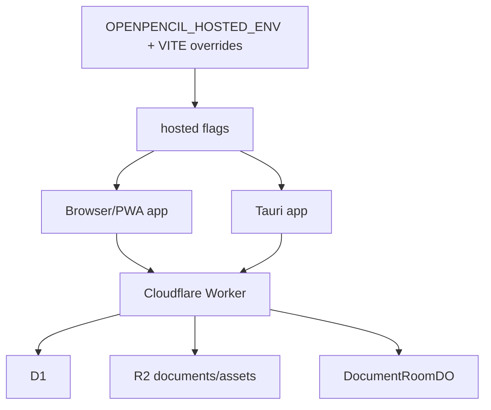

# Runtime Configuration and Environment Topology

Local development defaults to `OPENPENCIL_HOSTED_ENV=local`, with hosted auth, docs, and collaboration disabled. Precedence is: explicit `VITE_*` capability/origin/callback/app overrides, then the recognized `OPENPENCIL_HOSTED_ENV` entry in `ENV_DEFAULTS`, then local-safe defaults; unknown/unset environments resolve to local. `src/app/hosted/flags.ts` resolves `VITE_HOSTED_AUTH_ENABLED`, `VITE_HOSTED_DOCS_ENABLED`, `VITE_HOSTED_COLLAB_ENABLED`, `VITE_API_ORIGIN`, `VITE_AUTH_CALLBACK_URL`, and `VITE_APP_URL`. `hostedDocs` requires auth; collaboration requires auth and docs; any hosted feature requires an API origin; auth requires a callback URL. Resolution is cached after first use.

Mode matrix: `local-only` means all hosted flags false and local file/memory backends; `hosted-auth-local-docs` enables session/auth while document source remains local; `hosted-docs-single-user` enables auth plus hosted document backend and canonical document IDs; `hosted-collab` adds hosted room/Yjs transport and requires a route document ID. Browser and Tauri share these frontend flags, but Tauri separately gates hosted docs and native file associations; PWA registration is browser-only. Tests that must move with a new combination are `tests/e2e/hosted-route-gating.spec.ts`, `tests/e2e/hosted-collab.spec.ts`, `tests/e2e/document-backend.spec.ts`, `tests/unit/hosted-storage.test.ts`, and the hosted flag proof.

Declared topology is local, preview (auth only), staging (auth/docs), and production (auth/docs). `api/wrangler.jsonc` binds the Worker entrypoint `api/src/worker.ts` to separate stage-specific D1 databases, R2 document/assets buckets, and `DocumentRoomDO`. Named Wrangler environments repeat bindings rather than inheriting them. Apply migrations such as `api/migrations/0001_hosted_documents.sql` through the environment's Wrangler workflow; run `cd api && bun run cf-typegen` after binding changes.

Auth is asserted at Worker startup by `assertAuthConfigured`: real deployments require `ELF_JWKS_URL`, `ELF_ISSUER`, and `ELF_AUDIENCE`; the exact `ALLOW_DEV_STUB_AUTH=1` bypass is for local tests only. `getRealVerifier()` caches verifiers by the tuple `(JWKS URL, issuer, audience)`; changing any tuple component selects a new cached verifier, while the source does not expose an explicit cache reset for environment mutation. Stub verification is selected by the current environment/config path and should not be assumed to invalidate a previously cached real verifier; cache-transition behavior is not covered by the auth tests, which focus on valid/invalid tokens, credential decoding, conflicts, and missing preconditions. These verifier URLs/claims are configuration, while deployment, signing, publishing, proof, and MCP bearer values are secret runtime state and are supplied through Hush/CI or the process environment. Named Wrangler environments must repeat variables and bindings because they do not inherit top-level values; `api/src/wrangler.jsonc` intentionally excludes the dev stub from staging/production. Frontend `resolveHostedConfig` applies explicit Vite overrides over `ENV_DEFAULTS`, caches the result, and derives `local-only`, `hosted-auth-local-docs`, `hosted-docs-single-user`, or `hosted-collab`; this selection is independent of Worker JWT verification. `src/app/hosted/session.ts` calls `/api/session` with cookies or a test bearer token, and `/login` -> ELF authorize -> `/auth/callback` establishes the browser session. Tests: `api/src/auth.test.ts`, `tests/e2e/hosted-route-gating.spec.ts`, `tests/e2e/hosted-collab.spec.ts`, and `bun run proof:flags`.

Browser startup is `src/main.ts` plus Vite/PWA plugins in `vite.config.ts`; the config injects the app version and local automation token, creates aliases, copies CanvasKit assets, installs raw Markdown/Tailwind/icon/component/PWA/automation plugins, and configures the dev server. Tauri uses the same frontend and `desktop/tauri.conf.json`, native file associations, shell, filesystem, updater, and generated menu data. Regenerate the menu with `bun run generate:tauri-menu`; CanvasKit assets are copied by `vite/canvaskit-assets.ts`. PWA registration is skipped in Tauri.

Use `bun run svc:ensure` for managed `app` and `docs` services. `pitchfork.toml` owns ports/readiness; do not guess ports or stop unrelated services.

Focused checks: `bun run proof:flags`, `bun run proof:hosted`, `bun run proof:all`, `cd api && bun test`, and `bun run test:packages`.
