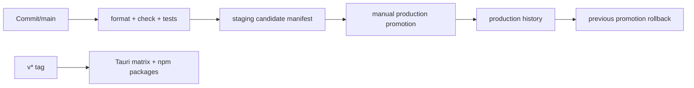

# Quality, CI, Build, and Release Workflow

Install with `bun install --frozen-lockfile`. Root script composition is authoritative in `package.json`: `build` runs `build:packages`, `lint`, then Vite; `check` adds package builds, Oxlint, tsgo, Vue type checks, locale/package/architecture checks, type shapes, and jscpd; `test` invokes Playwright's `openpencil` project; `test:unit` is `bun test ./tests/engine`; `test:figma` selects the Figma project; `proof:all` combines hosted flag and hosted API proofs. The hygiene standard is checked in via `.oxfmtrc.json` and `oxlint.json`: Oxfmt is pinned to `0.60.0`, Oxlint to `1.75.0`, and Oxlint extends the shared `@ch5me/oxlint-config/react.json` preset.

- `bun run dev` — Vite app on the configured local app port.
- `bun run build` — package builds, lint, then Vite production build.
- `bun run check` — package builds, lint/type checks, Vue checks, locale/package/architecture checks, type-shape and duplicate-code checks.
- `bun run format:check` — run the checked-in Oxfmt configuration and fail if formatting changes the worktree; because the script invokes Oxfmt with `--write`, inspect or reset the resulting changes when using it as a check.
- `bun run lint:fix` — apply Oxlint fixes; `bun run fix` runs that command followed by `npm run format`, so review the resulting worktree rather than treating it as a read-only check.
- `bun run test:unit` — `bun test ./tests/engine`.
- `bun run test` — Playwright `openpencil` E2E; it starts `bun run dev` on port 1420 when needed. `playwright.config.ts` uses one worker, 15s timeout, 1280x800 at device scale 2, dark color scheme, Chromium-style default, a selected WebKit project, and a separate Figma project.
- `bun run test:packages` — metadata and packed-distribution smoke checks.
- `bun run test:dupes` — jscpd threshold check.
- `bun run test:update` — update Playwright snapshots deliberately.
- `bun run test:coverage` — engine test coverage.
- `bun run visual-compare` — visual comparison script.
- `bun run proof:preview` — verify a preview deployment.
- `bun run docs:build` — VitePress build.
- `bun run tauri dev` / `bun run tauri build` — native development/build.

Package build order is Kiwi, Fig, Core, DOM-CSS, Vue, MCP, CLI (`package.json` `build:packages`). Narrow checks include `bun test <path>`, `bun --filter @open-pencil/kiwi check`, `bun --filter @open-pencil/fig check`, and `cd packages/dom-css && bun run check`.

Forgejo CI runs format, `bun run check`, engine tests, and duplication checks; API CI runs `cd api && bun run cf-typegen && bun test`. Heavy FIG round trips require Git LFS and `BUN_HEAVY_TESTS=true` with `bun test --timeout 180000 tests/engine/fig-roundtrip.test.ts`. Real LLM tests require explicit opt-in and a provider key; they are not baseline validation.

Releases are tag-triggered by `v*`: update versions/changelog, commit `Release v0.x.y`, tag and push, then the build workflow produces signed Tauri artifacts for macOS, Windows, and Linux, creates a draft Forgejo release, and publishes `@open-pencil/core`, `@open-pencil/cli`, `@open-pencil/mcp`, and `@open-pencil/vue` to `https://npm.ch5.me/`. Signing and publishing secrets are CI/Hush inputs, not repository files.

Deployment commands are `bun run release:candidate`, `bun run promote:production`, and `bun run rollback:production`. Staging builds with `OPENPENCIL_HOSTED_ENV=staging`, records `.build-manifests/staging.json`, and deploys Cloudflare Pages. Promotion records `.build-manifests/history.json`; rollback needs at least two records. Verify deployment URLs with `curl -sf` and run hosted proofs against the selected API. Read `.forgejo/workflows/*.yml` before changing release behavior: production promotion currently rebuilds with production configuration rather than directly copying a staging artifact.

