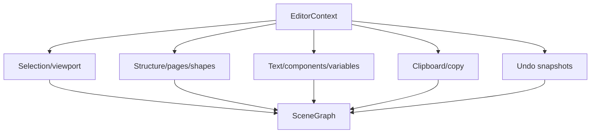

# Core SceneGraph and Editor State

`packages/core/src/scene-graph/` owns node types, pages, variables, images, hierarchy, hit testing, copying, snapping, and undo primitives. `packages/core/src/editor/create.ts` assembles factories such as `createSelectionActions`, `createStructureActions`, `createUndoActions`, and `createTextActions` into a flat `Editor` object. Each factory receives the shared `EditorContext`; consumers should use the returned actions rather than edit graph internals.

Mutation/history is an invariant: user-visible changes must define an undo boundary, preserve selection and parent/child relationships, and keep layout/render state coherent. AI mutation follows the same contract through snapshots. Components and instances retain dependency relationships during copy/export; see [documents and formats](../../architecture/documents-and-formats.md).

The root app wraps this core editor in a reactive `EditorStore`; the Vue SDK exposes its context and actions without owning the graph. Focused tests include `tests/engine/scene-graph/undo/mutation.test.ts`, scene graph selection/structure suites, and editor-store path/session tests.

